## RabbitMQ

### 一、基础概念

#### 1. 什么是MQ？

>  message queue 消息队列
>
> **使用：**把要传输的数据（消息）放在队列中，用队列机制来实现消息传递——生产者产生消息并把消息放入队列，然后由消费者去处理。消费者可以到指定队列拉取消息，或者订阅相应的队列，由MQ服务端给其推送消息。
>
> **使用场景：**
>
> - 异步处理 - 相比于传统的串行、并行方式，提高了系统吞吐量。
> - 应用解耦 - 系统间通过消息通信，不用关心其他系统的处理。
> - 流量削锋 - 可以通过消息队列长度控制请求量；可以缓解短时间内的高并发请求。
> - 日志处理 - 解决大量日志传输。
> - 消息通讯 - 消息队列一般都内置了高效的通信机制，因此也可以用在纯的消息通讯。比如实现点对点消息队列，或者聊天室等。
>
> **缺点：**
>
> - 系统可用性降低
>
> - 系统复杂度提高：比如：一致性问题、如何保证消息不被重复消费、如何保证消息可靠性传输等
>
> - 一致性问题：A 系统处理完了直接返回成功了，要是 BCD 三个系统那里，BD 两个系统写库成功了，结果 C 系统写库失败了，数据就不一致了。

#### 2. 消息中间件对比


| 11111111111 | ActiveMQ                                                | RabbitMQ                                                     | RocketMQ                                                     | Kafka                                                        | ZeroMQ               |
| ----------- | ------------------------------------------------------- | ------------------------------------------------------------ | ------------------------------------------------------------ | ------------------------------------------------------------ | -------------------- |
| 单机吞吐量  | 比RabbitMQ低                                            | 2.6w/s（消息做持久化）                                       | 11.6w/s                                                      | 17.3w/s                                                      | 29w/s                |
| 开发语言    | Java                                                    | Erlang                                                       | Java                                                         | Scala/Java                                                   | C                    |
| 主要维护者  | Apache                                                  | Mozilla/Spring                                               | Alibaba                                                      | Apache                                                       | iMatix，创始人已去世 |
| 成熟度      | 成熟                                                    | 成熟                                                         | 开源版本不够成熟                                             | 比较成熟                                                     | 只有C、PHP等版本成熟 |
| 订阅形式    | 点对点(p2p)、广播（发布-订阅）                          | 提供了4种：direct, topic ,Headers和fanout。fanout就是广播模式 | 基于topic/messageTag以及按照消息类型、属性进行正则匹配的发布订阅模式 | 基于topic以及按照topic进行正则匹配的发布订阅模式             | 点对点(p2p)          |
| 持久化      | 支持少量堆积                                            | 支持少量堆积                                                 | 支持大量堆积                                                 | 支持大量堆积                                                 | 不支持               |
| 顺序消息    | 不支持                                                  | 不支持                                                       | 支持                                                         | 支持                                                         | 不支持               |
| 性能稳定性  | 好                                                      | 好                                                           | 一般                                                         | 较差                                                         | 很好                 |
| 集群方式    | 支持简单集群模式，比如’主-备’，对高级集群模式支持不好。 | 支持简单集群，'复制’模式，对高级集群模式支持不好。           | 常用 多对’Master-Slave’ 模式，开源版本需手动切换Slave变成Master | 天然的‘Leader-Slave’无状态集群，每台服务器既是Master也是Slave | 不支持               |
| 管理界面    | 一般                                                    | 较好                                                         | 一般                                                         | 无                                                           | 无                   |


MQ选型总结

> 中小型项目：技术实力一般，挑战不高，RabbitMQ
>
> 大型互联网项目：RocketMQ
>
> 大数据领域：实时计算、日志采集等场景，Kafka


#### 3. MQ常见问题

- 消息顺序问题
- 消息一致性问题


### 二、RabbitMQ基础

RabbitMQ是一款开源的，Erlang编写的，基于AMQP协议的消息中间件

#### 1. RabbitQM的基本概念

##### 1.1 AMQP协议

> 二进制协议，应用层协议规范，可以有很多不同的消息中间件
>
> server：消息队列节点
>
> virtual host：虚拟主机
>
> exchange：交换机，用来接收消息投递
>
> message queue：消息队列，被消费者监听消费
>
> 其中交换机和消息队列有绑定关系
>
> 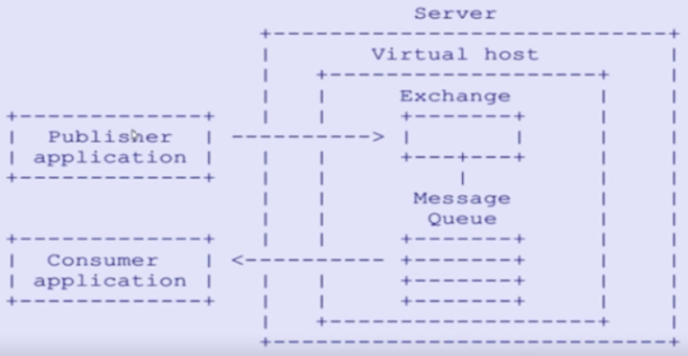
>
> 


##### 1.2 RabbitMQ核心概念

> - Broker： 简单来说就是消息队列服务器实体
>
> - Exchange： 消息交换机，它指定消息按什么规则，路由到哪个队列
>
> - Queue： 消息队列载体，每个消息都会被投入到一个或多个队列
>
> - Binding： 绑定，它的作用就是把exchange和queue按照路由规则绑定起来
>
> - Routing Key： 路由关键字，exchange根据这个关键字进行消息投递
>
> - VHost： vhost 可以理解为虚拟 broker ，即 mini-RabbitMQ server。其内部均含有独立的 queue、exchange 和 binding 等，但最最重要的是，其拥有独立的权限系统，可以做到 vhost 范围的用户控制。当然，从 RabbitMQ 的全局角度，vhost 可以作为不同权限隔离的手段（一个典型的例子就是不同的应用可以跑在不同的 vhost 中）。
>
> - Producer： 消息生产者，就是投递消息的程序
>
> - Consumer： 消息消费者，就是接受消息的程序
>
> - Channel： 消息通道，在客户端的每个连接里，可建立多个channel，每个channel代表一个会话任务
>
>   
>
>   由Exchange、Queue、RoutingKey三个才能决定一个从Exchange到Queue的唯一的线路。
>
>   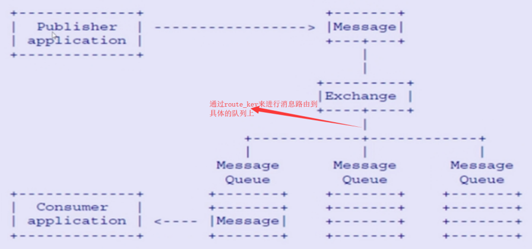


##### 1.3 exchange 交换机

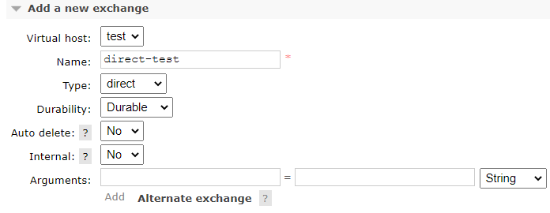

> - virtual host  虚拟主机
> - name	
> - type  交换机类型 direct,topic,fanout,headers
> - durability  是否持久化
> - auto delete  没有队列绑定到该交换机，那么该交换机会自动删除
> - internal  当前交换机是否RabbitMQ用户内部使用不常用，默认false
> - arguments 扩展参数
>
> **交换机类型**
>
> - **direct exchange**  如果路由键完全匹配，消息就被投递到相应的队列
>
> ```
> 发送的direct exhchange 的消息都会被投递到与routekey名称(与队列名称)相同的queue上 
> 不需要交换机和任何队列绑定,消息将会投递到route_key名称和队列名称相同的队列上
> 
> 若不指定交换机默认通过default exchange 投递
> ```
>
> 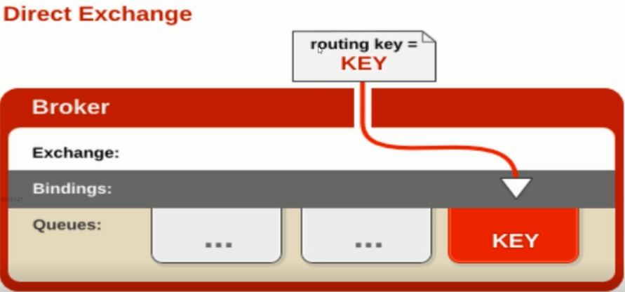
>
> -  **topic exchange**  使来自不同源头的消息能够到达同一个队列
>
> ```
> 在队列上绑到topic交换机上的路由key,可以是通过通配符来匹配的
> log.# ：可以匹配一个单词 也可以匹配多个单词 比如 log.# 可以匹配log.a log.a.b  
> log.* : 可以匹配一个单词 比如 log.* 可以匹配log.a 但是不可以匹配log.a.b
> ```
>
> 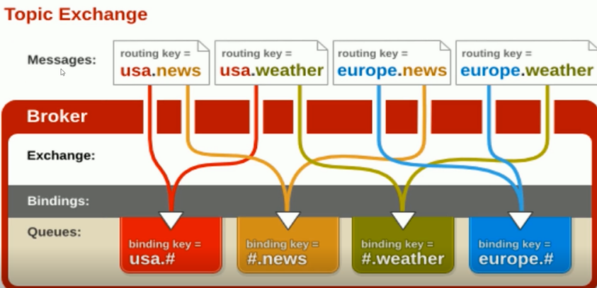
>
> - **fanout exchange**  如果交换器收到消息，将会广播到所有绑定的队列上
>
> ```
> 消息通过从交换机到队列上不会通过路由key 所以该模式的速度是最快的 只要和交换机绑定的那么消息就会 被分发到与之绑定的队列上
> ```
>
> 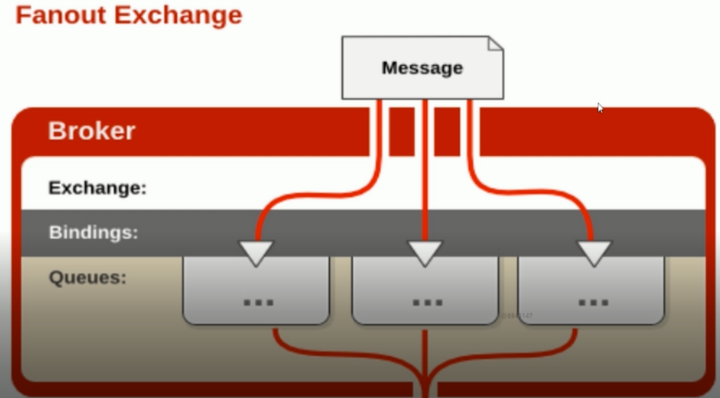


##### 1.4 Queue 队列

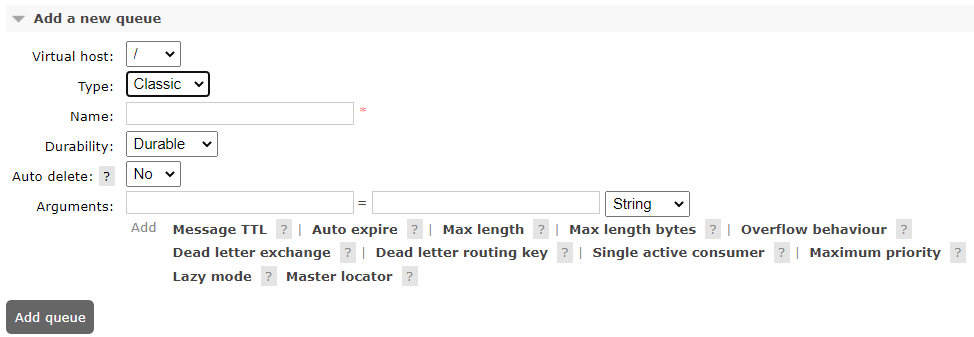

> **队列属性**
>
> - virtual host
>
> - type 队列类型
>
>   ```
>   Classic
>   Quorum
>   ```
>
> - durability 
>
>   ```
>   是否持久化, 队列的声明默认是存放到内存中的，如果rabbitmq重启会丢失
>   ```
>
> - auto delete  表示最后一个监听被移除那么该队列就会被删除
>
> - exclusive  有且只有一个消费者监听,服务停止的时候删除该队列

##### 1.5 消息 

> - body 消息体  
> - properties 属性  com.rabbitmq.client.AMQP.BasicProperties
> - envelope  链路信息  com.rabbitmq.client.Envelope

#### 2. 高级特性

##### 2.1 幂等性及消息的幂等性(生产端ACK)

**接口的幂等性**： 对接口发起一次货多次调用，产生的结果一致

**MQ解决幂等性**

> - **消息处理流程**：
>
> 1. 生产者发送消息至MQ
>
> 2. MQ服务器将消息落地
> 3. MQ服务器向生产者发送Ack
> 4. 消息消费者消费消息
> 5. 消费者发送Ack
> 6. MQ服务器将消息删除
>
> - **消息出现问题的情况**
>
> 为了保障消息的百分之百的投递，使用了消息重发，确认机制，使得消息可能被重复发送，由上图可知 道，由于网络原因，第三步的上半场ack丢失还是第五步的下半场ack丢失 
>
> - **服务端是如何保证幂等性的？** 
>
> 消息队列的服务中，对每一条消息都会生成一个全局唯一的与业务无关的ID(inner_msg_id),当mq_server 接受到消息的时候，先根据inner_msg_id 是否需要重复发送，再决定消息是否落DB ,这样保证每条消息都只会落一次DB
>
> - **消费端如何来做到幂等性的？** 
>
> 还是把对每条消息做生成一个唯一性的ID 通过redis的setnx命令来保证幂等性

##### 2.2 消息的Confirm机制

> **消息的确认**：生产者将消息发送MQ后，如果MQ接到消息，就会给生产者一个应答，以此来确保消息被成功发送至MQ，confirm机制是消息可靠性投递的核心保证
>
> **实现步骤：**
>
> - 在channel上开启确认模式  channel.confirmSelect();
> - 在channel添加监听 channel.addConfirmListener(new ConfirmListener());

##### 2.3 消息的return listener机制

> 生产端把消息投递至exchange上，然后通过routingkey把消息路由至某个队列上，然后消费者监听队列进行消息消费
>
> **可能出现的问题**
>
> - broker上没有对应的exchange接收该消息
> - 消息能够投递至broker上，但是根据routingkey找不到对应的队列
>
> **return Listener 处理不可达消息**
>
> - 若消息生产端mandatory设置为true，调用生产端的ReturnListener处理
> - 默认情况下，MQ自动删除该消息

##### 2.4 消费端自定义消费监听

> 参考ackConsumer

##### 2.5 消费端限流

> MQ中堆积了成千上万条消息未处理，这时随便打开消费者会导致消费者压力过大
>
> **解决方案**
>
> 提供一个钟qos（服务质量保证）,也就是在关闭了消费端的自动ack的前提下，我们可以设置阈值（出队）的消息数没有被确认（手动确认），那么就不会再推送消息过来. 
>
> **限流的级别**：consumer或channel 
>
> **实现的方式** 
>
> ```java
> /**
>      * @param prefetchSize 指定的是设定消息的大小
>      * @param prefetchCount 表示设置消息的阈值，每次过来几条消息
>      * @param global 表示是channel级别的还是consumer的限制
>      */
>     void basicQos(int prefetchSize, int prefetchCount, boolean global) throws IOException;
> ```

##### 2.6 消费端Ack

>消费端Ack模式：手动ack和自动ack
>
>做消息限流的时候需要关闭自动ack，进行手动Ack确认
>
>如果业务出现问题，可以进行Nack
>
>**重回队列：**
>
>当消费端进行了nack的时候，可以设置消息是否重回队列
>
>```java
>            //拒收 重回队列
>            channel.basicNack(envelope.getDeliveryTag(),false,true);
>            //拒收 不重回队列
>            channel.basicNack(envelope.getDeliveryTag(),false,false);
>```

##### 2.7 死信队列DLX(Dead-leater-exchange)

> 队列中的消息没有消费者消费，该消息就成为一个**死信dead-leater**，该消息被重新发送到另外一个exchange上的话，这个exchange就是**死信队列**
>
> **消息变成死信的几种情况：**
>
> - 消息被拒绝：basic.reject/basic.nack，并且requeue属性为false
> - 消息TTL过期：消息本身设置了过期时间，或者队列设置了过期时间
> - 队列达到最大长度
>
> 死信队列也是一个正常的exchange，也会通过routingkey绑定到具体的队列上
>
> 

#### 3. spring整合


### 三、问题及解决方案

#### 1. 如何保障消息的可靠性投递

##### 1.1 什么是生产端的可靠性投递

>  **①**:**保障消息成功发送出去** 
>
> **②**:**保障**mq**节点成功接收消息** 
>
> **③**:**消息发送端需要收到**mq**服务的确认应答** 
>
> **④**:**完善的消息补偿机制（百分百成功成功 需要该步骤）** 

##### 1.2 解决方案

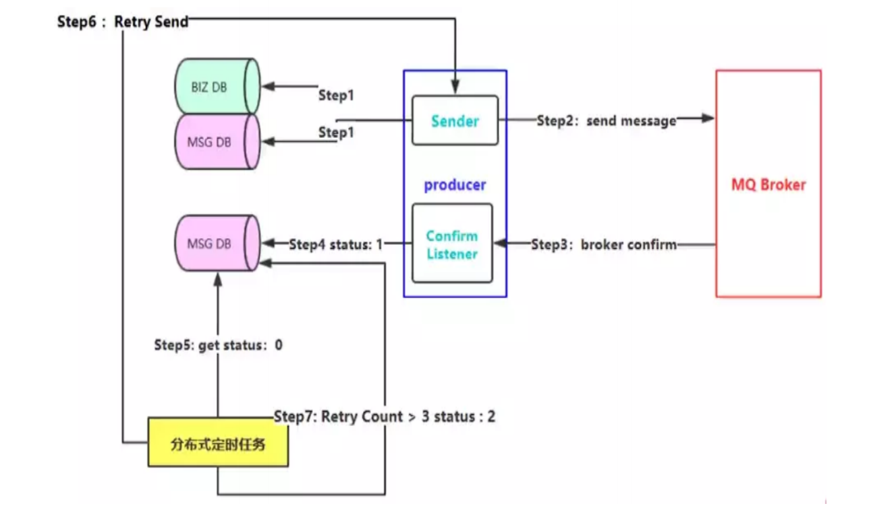


##### 1.3 案例


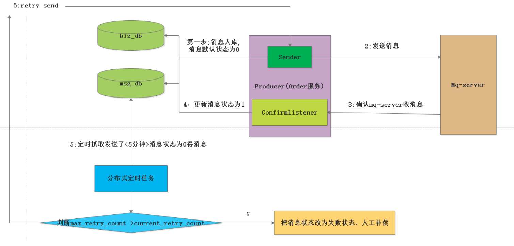

**流程：**

> **正常链路流程** 
>
> 1. (该环节调用了操作了二次数据库):在创建订单的操作的时候，把数据插入到订单相关的表中,并且构造调用物流模块的数据消息，把消息插入到消息表中,初始状态为0
> 2. 把物流消息投递到消息队列中
> 3. 消息队列访问一个确认消息,并且由，订单服务来监控mq server的确认消息 
> 4. 根据收到的确认消息来更新数据库中的消息记录的状态 
>
> **异常流程**
>
> 3. 由于网络闪断等原因，导致消费端监控mq服务访问的确认消息没有收到，那么在msg_db中的那条消息的 状态永远就是0状态。这个时候，我们需要对这种情况下做出补偿
>
> **异常补偿机制**
>
> 1. 插入msg_db 表中定时扫描状态为0的记录，进行消息重试
> 2. 若重试的次数超过五次状态还是为0的话，我们就把消息状态改为2
> 3. 人工确认状态为2的消息
>
> **缺点**
>
> 既插入了业务数据表，也同时插入了消息记录表，进行了二次db操作，在高并发的环境下，会造成性能瓶颈 

##### 1.4 方案优化

**优化思路：**加入监听机制

> - 监听机制
>
>   

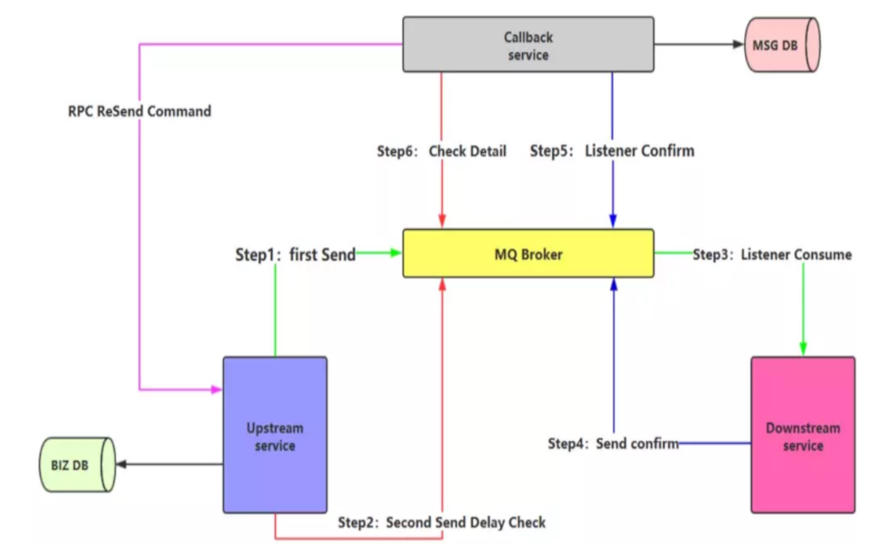


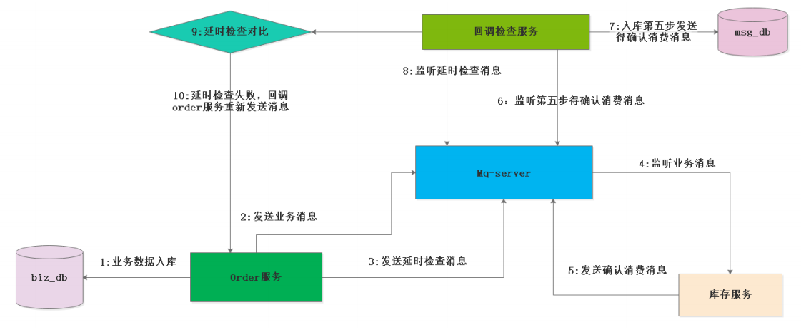


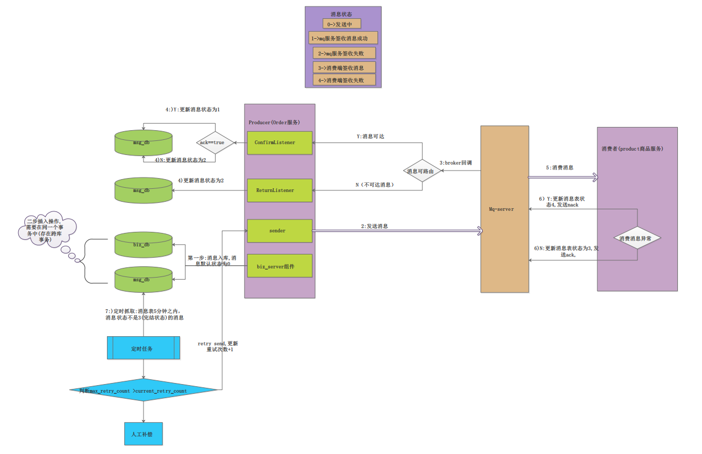


### 附录一、RabbitMQ安装及常用命令

```shell
# rabbitmq版本依赖的erlang版本要求：https://www.rabbitmq.com/which-erlang.html

# 下载 el8代表Centos8
wget https://github.com/rabbitmq/erlang-rpm/releases/download/v23.2.1/erlang-23.2.1-1.el8.x86_64.rpm
wget http://mirror.centos.org/centos/8/AppStream/x86_64/os/Packages/socat-1.7.3.3-2.el8.x86_64.rpm
wget rabbitmq-server-3.8.3-1.el8.noarch.rpm
# 安装rpm包
rpm -ivh erlang-23.2.1-1.el8.x86_64.rpm
rpm -ivh socat-1.7.3.3-2.el8.x86_64.rpm
rpm -ivh rabbitmq-server-3.8.9-1.el8.noarch.rpm

# 激活管理工具
rabbitmq-plugins enable rabbitmq_management

# 添加用户
rabbitmqctl add_user admin admin
# 添加超级用户权限
rabbitmqctl set_user_tags admin administrator
# 查看用户列表
rabbitmqctl list_users
# 


# 使用户user1具有vhost1这个virtual host中所有资源的配置、写、读权限以便管理其中的资源
rabbitmqctl  set_permissions -p vhost1 user1 '.*' '.*' '.*' 
# 查看权限
rabbitmqctl list_user_permissions user1
rabbitmqctl list_permissions -p vhost1
# 清除权限
rabbitmqctl clear_permissions [-p VHostPath] User
# 删除用户
rabbitmqctl delete_user Username
# 修改用户密码
rabbitmqctl change_password Username Newpassword


# 常用命令
#启动
service rabbitmq-server start
#停止
service rabbitmq-server stop
#查看状态
service rabbitmq-server status
#重启
service rabbitmq-server restart
```

